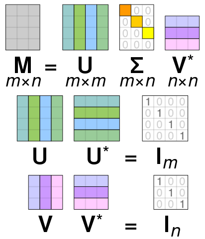

# Singul&auml;rwert Zerlegung

Die Singul&auml;rwertzerlegung ist ein Universalwerkzeug der Datenanalyse und
Modellsynthese. 
Die wesentliche Eigenschaft ist die Quantifizierung
wesentlicher und redundanter Anteile in Daten oder Operatoren. 

Die direkte Anwendung ist die *Principal Component Analysis*, die orthogonale Dimensionen in multivariablen Daten identifiziert, die nach der St&auml;rke der Varianz sortiert sind. So kann diese erste *principal component* als die *reichhaltigste* Datenrichtung interpretiert werden und die letzten Richtungen (insbesondere wenn die Varianz komplett verschwindet) als wenig aussagekr&auml;ftig (und insbesondere redundant) identifiziert werden.

Andere Anwendungen ist die L&ouml;sung von &uuml;berbestimmten
Gleichungssystemen (wie sie in der linearen Regression vorkommen) oder das
Entfernen von *Rauschen* aus Daten.

::: {.theorem #SVD name="Singul&auml;rwertzerlegung (SVD)"}
Sei $A\in \mathbb C^{m\times n}$, $m\geq n$. Dann existieren orthogonale Matrizen $U \in \mathbb C^{m\times m}$ und $V\in \mathbb C^{n\times n}$ und eine Matrix $\Sigma \in \mathbb R^{m\times n}$ der Form
\begin{equation*}
\Sigma = 
\begin{bmatrix}
\sigma_1 & 0 & \dots & 0\\
0 & \sigma_2 &\ddots & \vdots\\
0 & \ddots & \ddots &0\\
  0 & \dots&0 & \sigma_n \\
  0 & 0 & \dots & 0 \\
  \vdots & \ddots &  & \vdots\\
  0 & 0 & \dots & 0
\end{bmatrix}
\end{equation*}
mit reellen sogenannten *Singul&auml;rwerten*
\begin{equation*}
\sigma_1 \geq \sigma_2 \geq \dots \geq \sigma_n \geq 0
\end{equation*}
sodass gilt
\begin{equation*}
A = U \Sigma V^*
\end{equation*}
wobei gilt $V^* = \overline{V^T}$ (transponiert und komplex konjugiert).
:::

Ein paar Bemerkungen. 

 * Ist $A$ reell, k&ouml;nnen auch $U$ und $V$ reell gew&auml;hlt werden.
 * Die Annahme $m \geq n$ war nur n&ouml;tig um f&uuml;r die Matrix $\Sigma$ keine Fallunterscheidung zu machen. (F&uuml;r $m\leq n$ "steht der Nullblock rechts von den Singul&auml;rwerten"). Insbesondere gilt $A^* = V\Sigma U^*$ ist eine SVD von $A^*$.
 * Eine Illustration der Zerlegung ist [hier](@fig-SVD) zu sehen.

Wir machen einige &Uuml;berlegungen im Hinblick auf gro&szlig;e Matrizen. Sei dazu $m>n$, $A\in \mathbb C^{m\times n}$ und $A=U\Sigma V^*$ eine SVD wie in Theorem \@ref(thm:SVD). Sei nun
\begin{equation*}
U = \begin{bmatrix}
U_1 & U_2
\end{bmatrix}
% = \begin{bmatrix} V_1^* & V_2^*
\end{equation*}
partitioniert sodass $U_1$ die ersten $n$ Spalten von $U$ enth&auml;lt.

Dann gilt (nach der Matrix-Multiplikations Regel *Zeile mal Spalte* die Teile $U_2$ und $V_2$ immer mit dem Nullblock in $\Sigma$ multipliziert werden) dass
\begin{equation*}
A = U\Sigma V = 
\begin{bmatrix}
U_1 & U_2
\end{bmatrix}
\begin{bmatrix}
\hat \Sigma \\ 0
\end{bmatrix}
V^*
% \begin{bmatrix} V_1^* \\ V_2^* \end{bmatrix}
=
U_1 
\hat \Sigma
V^*
% \begin{bmatrix} V_1^* \\ V_2^* \end{bmatrix}
\end{equation*}
Es gen&uuml;gt also nur die ersten $m$ Spalten von $U$ zu berechnen. Das ist die sogenannte **slim SVD**.

Hat, dar&uuml;berhinaus, die Matrix $A$ keinen vollen Rang, also $\operatorname{Rg}(A) = r < n$, dann:

 * ist $\sigma_i=0$, f&uuml;r alle $i=r+1, \dotsc, n$, (wir erinnern uns, dass die Singul&auml;rwerte nach Gr&ouml;&szlig;e sortiert sind)
 * die Matrix $\hat \Sigma$ hat $n-r$ Nullzeilen
 * f&uuml;r die Zerlegung sind nur die ersten $r$ Spalten von $U$ und $V$ relevant -- die sogenannte **Kompakte SVD**.

In der Datenapproximation ist au&szlig;erdem die **truncated SVD** von Interesse. Dazu sei $\hat r<r$ ein beliebig gew&auml;hlter Index. Dann werden alle Singul&auml;rwerte,  $\sigma_i=0$, f&uuml;r alle $i=\hat r+1, \dotsc, n$, abgeschnitten -- das hei&szlig;t null gesetzt und die entsprechende *kompakte SVD* berechnet.

Hier gilt nun nicht mehr die Gleichheit in der Zerlegung. Vielmehr gilt 
\begin{equation*}
A \approx A_{\hat r}
\end{equation*}
wobei $A_{\hat r}$ aus der *truncated SVD* von $A$ erzeugt wurde. Allerdings ist diese Approximation von $A$ durch optimal in dem Sinne, dass es keine Matrix vom Rang $\hat r \geq r=\operatorname{Rg}(A)$ gibt, die $A$ (in der *induzierten* euklidischen Norm^[Auf Matrixnormen kommen wir noch in der Vorlesung zu sprechen.]) besser approximiert. Es gilt
\begin{equation*}
\min_{B\in \mathbb C^{m\times n}, \operatorname{Rg}(B)=\hat r} \|A-B\|_2 = \|A-A_{\hat r}\|_2 = \sigma_{\hat r + 1};
\end{equation*}
[vgl. Satz 14.15, @BolM04].

Zum Abschluss noch der Zusammenhang zur *linearen Ausgleichsrechnung*.
Die L&ouml;sung $w$ des Problems der *linearen Ausgleichsrechnung* war entweder als L&ouml;sung eines Optimierungsproblems
\begin{equation*}
\min_{w} \| Aw - y \|^2
\end{equation*}
oder als L&ouml;sung des linearen Gleichungssystems
\begin{equation*}
A^TAw=y.
\end{equation*}
Ist $A=U\Sigma V^*=U_1\hat \Sigma V^*$ (slim) "SV-zerlegt", dann gilt
\begin{equation*}
A^*Aw = V\hat \Sigma^*U_1^*U_1\hat \Sigma V^*w = V\hat \Sigma^2 V^* w
\end{equation*}
und damit
\begin{equation*}
A^*Aw = A^*y \quad \Leftrightarrow \quad V\hat \Sigma^2 V^*w  = V\hat \Sigma^*U_1^*y \quad \Leftrightarrow \quad w = V\hat \Sigma^{-1} U_1^*y
\end{equation*}
was wir (mit den Matrizen der vollen SVD) als
\begin{equation*}
w = V \Sigma^+ U^*y
\end{equation*}
schreiben, wobei
\begin{equation*}
\Sigma^+ = \begin{bmatrix}
\hat \Sigma^{-1} \\ 0_{m-n \times n}
\end{bmatrix}
\end{equation*}
.

**Bemerkung**: $\Sigma^+$ kann auch definiert werden, wenn $\hat \Sigma$ nicht invertierbar ist (weil manche Diagonaleintr&auml;ge null sind). Dann wird $\hat \Sigma^+$ betrachtet, bei welcher nur die $\sigma_i>0$ invertiert werden und die anderen $\sigma_i=0$ belassen werden. Das definiert eine sogenannte *verallgemeinerte Inverse* und l&ouml;st auch das Optimierungsproblem falls $A$ keinen vollen Rang hat.


{width=50% #fig-SVD}

## Aufgaben

### Norm und Orthogonale Transformation

Sei $Q\in \mathbb R^{n\times n}$ eine orthogonale Matrix und sei $y\in \mathbb R^{n}$. Zeigen Sie, dass
\begin{equation*}
\|y\|^2 = \|Qy \|^2
\end{equation*}
gilt. (2 Punkte)

### Kleinste Quadrate und Mittelwert

Zeigen sie, dass der *kleinste Quadrate* Ansatz zur Approximation einer Datenwolke 
\begin{equation*}
(x_i, y_i), \quad i=1,2,\dotsc,N,
\end{equation*}
mittels einer konstanten Funktion $f(x)=w_1$ auf $w_1$ auf den Mittelwert der $y_i$ f&uuml;hrt. (6 Punkte)

### QR Zerlegung und Kleinstes Quadrate Problem 

Sei $A\in \mathbb R^{m,n}$, $m>n$, $A$ hat vollen Rank und sei
\begin{equation*}
\begin{bmatrix}
Q_1 & Q_2
\end{bmatrix}
\begin{bmatrix}
\hat R \\ 0
\end{bmatrix} = A
\end{equation*}
eine QR-Zerlegung von $A$ (d.h., dass $Q$ unit&auml;r ist und $\hat R$ eine (im
Falle, dass $A$ vollen Rang hat invertierbare) obere Dreiecksmatrix. Zeigen sie, dass die L&ouml;sung von
\begin{equation*}
\hat R w = Q_1^T y
\end{equation*}
ein kritischer Punkt (d.h. der Gradient $\nabla_w$ verschwindet) von
\begin{equation*}
w \mapsto \frac 12 \| Aw - y \|^2
\end{equation*}
ist, also $w=\hat R^{-1}Q_1^T y$ eine L&ouml;sung des Optimierungsproblems
darstellt. Vergleichen Sie mit der SVD L&ouml;sung aus der Vorlesung.

### Eigenwerte Symmetrischer Matrizen

Zeigen Sie, dass Eigenwerte symmetrischer reeller Matrizen $A\in \mathbb R^{n\times n}$ immer reell sind.

### Singul&auml;rwertzerlegung und Eigenwerte -- 1

Zeigen Sie, dass die quadrierten Singul&auml;rwerte einer Matrix $A\in \mathbb R^{m\times n}$, $m>n$, genau die Eigenwerte der Matrix $A^TA$ sind und beschreiben Sie in welcher Beziehung sie mit den Eigenwerten von $AA^T$ stehen. **Hinweis**: hier ist "$m>n$" wichtig.

### Singul&auml;rwertzerlegung und Eigenwerte -- 2

Weisen Sie nach, dass die positiven Eigenwerte von 
\begin{equation*}
\begin{bmatrix}
0 & A^T \\ A & 0
\end{bmatrix}
\end{equation*}
genau die *nicht-null* Singul&auml;rwerte von $A$ sind.

### Truncated SVD

 1. Berechnen und plotten sie die Singul&auml;rwerte einer $4000\times 1000$ Matrix mit zuf&auml;lligen Eintr&auml;gen und die einer Matrix mit "echten" Daten (hier Simulationsdaten einer Stroemungssimulation)^[ [Download bitte hier](https://owncloud.gwdg.de/index.php/s/sAjEy9B8kIbzoYj) -- Achtung das sind 370MB].  Berechnen sie den Fehler der *truncated SVD* $\|A-A_{\hat r}\|$ f&uuml;r $\hat r = 10, 20, 40$ f&uuml;r beide Matrizen.
 1. Was l&auml;sst sich bez&uuml;glich einer Kompression der Daten mittels SVD f&uuml;r die beiden Matrizen sagen. (Vergleichen sie die plots der Singul&auml;rwerte und beziehen sie sich auf die gegebene Formel f&uuml;r die Differenz).
 1. F&uuml;r die "echten" Daten: Speichern sie die Faktoren der bei $\hat r=40$ abgeschnittenen SVD und vergleichen Sie den Speicherbedarf der Faktoren und der eigentlichen Matrix.

Beispielcode:


``` python
import numpy as np
import scipy.linalg as spla
import matplotlib.pyplot as plt

randmat = np.random.randn(4000, 1000)

rndU, rndS, rndV = spla.svd(randmat)

print('U-dims: ', rndU.shape)
print('V-dims: ', rndV.shape)
print('S-dims: ', rndS.shape)

plt.figure(1)
plt.semilogy(rndS, '.', label='Singulaerwerte (random Matrix)')

realdatamat = np.load('velfielddata.npy')

# # Das hier ist eine aufwaendige Operation
rlU, rlS, rlV = spla.svd(realdatamat, full_matrices=False)
# # auf keinen Fall `full_matrices=False` vergessen

print('U-dims: ', rlU.shape)
print('V-dims: ', rlV.shape)
print('S-dims: ', rlS.shape)

plt.figure(1)
plt.semilogy(rlS, '.', label='Singulaerwerte (Daten Matrix)')

plt.legend()
plt.show()
```

**Hinweis**: Es gibt viele verschiedene Normen f&uuml;r Vektoren und Matrizen. Sie d&uuml;rfen einfach mit `np.linalg.norm` arbeiten. Gerne aber mal in die Dokumentation schauen *welche* Norm berechnet wird.

