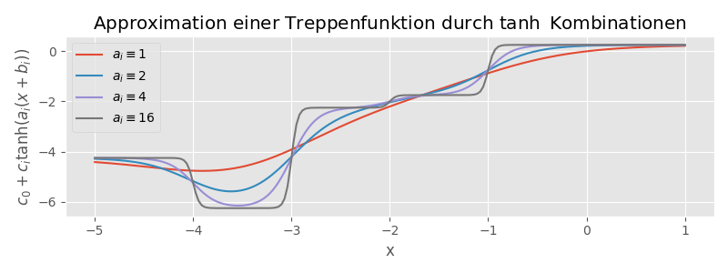

# Best and Universal Approximation

\def\PLab{\operatorname{PL}[a, b]}
\def\Cab{\mathcal{C}[a, b]}

Alle bisher betrachteten Approximationsprobleme waren in Bezug auf eine *2-norm*
("least squares") formuliert. Die f&uuml;r die Berechnung unmittelbaren Vorteile
sind die

1. Differenzierbarkeit der Norm und die
2. Charakterisierung der Optimall&ouml;sung &uuml;ber Orthogonalit&auml;t.

Ein g&auml;ngiges Optimierungsproblem, eine Bestapproximation zu einer stetigen
Funktion $f\colon [a, b]\to \mathbb R^{}$ in einer passenden Menge von Funktionen
$\mathcal G$ bez&uuml;glich der *Supremumsnorm*^[f&uuml;r ein kompaktes
Intervall wird das zur *Maximumsnorm*] zu finden
\begin{equation*}
\min_{g\in \mathcal G} \|f-g\|_\infty = 
\min_{g \in \mathcal G}\bigl (\max_{x\in [a, b]}|f(x)-g(x)|\bigr )
\end{equation*}
f&auml;llt nicht darunter.
Die entstehenden Schwierigkeiten und theoretische und praktische Ans&auml;tze
zur m&ouml;glichen L&ouml;sung dieses sogenannten
*Tschebyscheff-Approximation*-Problem, sind in [Kapitel 8.7.2, @RicW17] gut
nachzulesen.

Wir wollen hier nachvollziehen, dass klassische neuronale Netze, dieses Problem
approximativ aber mit beliebiger Genauigkeit $\epsilon$ l&ouml;sen k&ouml;nnten. Die
Schritte da hin sind wie folgt

1. Zu einem gegebenen $f\in \mathcal C[a, b]$ (einer reellwertigen, stetigen Funktion
   auf einem
   endlichen und abgeschlossenen Intervall) existiert immer eine st&uuml;ckweise
   Stetige Funktion $f_N$ mit endlich vielen *Sprungstellen*, sodass 
   \begin{equation*}
   \|f-f_N\|_\infty < \frac \epsilon2
   \end{equation*}

2. Zu diesem $f_N$ k&ouml;nnen wir immer eine Funktion
   \begin{equation*}
   s_M(x) = c_0 + \sum_{i=1}^Mc_i \tanh (a_i(x - b_i))
   \end{equation*}
   konstruieren (durch Anpassung der Parameter $c_0$, $c_i$, $b_i$, $a_i$,
   $i=1,\dotsc, M$) sodass 
   \begin{equation*}
   \|f_N-s_M\| < \frac \epsilon2.
   \end{equation*}

3. Wir interpretieren $s_M$ als ein neuronales Netz mit einer *hidden layer* und
   k&ouml;nnen konstatieren dass
   \begin{equation*}
   \|f-s_M\|_\infty \leq \|f-f_N\|_\infty + \|f_N-s_M\|_\infty < \frac \epsilon2
   + \frac \epsilon2 = \epsilon.
   \end{equation*}

Einige Fragen werden wir unbeantwortet lassen m&uuml;ssen, vor allem

 * wie w&auml;hlen wir $M$ (das Resultat sagt nur $M$ muss gro&szlig; genug
   sein)

und 

 * wie wirkt sich in der Praxis die approximative Berechnung von $a_i$--$c_i$
   auf die Approximation aus?

Dennoch gibt dieses Beispiel einen Einblick in die Funktionsweise der
Approximation und das referenzierte *universal
approximation theorem* ist Grundlage vieler Analyseans&auml;tze f&uuml;r
neuronale Netzwerke.

In Schritt 1, wird die st&uuml;ckweise stetige Funktion $f_N$ definiert. Die
Existenz folgt aus dem Satz

::: {.theorem #thm-pl-dense-C name="St&uuml;ckweise stetige Funktion liegen dicht"}
Sei $[a, b]\subset \mathbb R^{}$ ein abgeschlossenes endliches Intervall. 
Die Menge $\operatorname{pl}[a, b]$ aller st&uuml;ckweise stetigen Funktionen auf $[a, b]$ *liegt dicht*
in $\mathcal C[a, b]$ sodass f&uuml;r ein beliebiges $f\in \mathcal C[a, b]$ und $\varepsilon > 0$, immer ein $g\in
\operatorname{pl}[a, b]$ existiert mit $\|f-g\|_\infty<\varepsilon$.
:::

::: {.proof}
Der Beweis ist klassisch -- hier nur die relevanten und konstruktiven Elemente.

An sich muss f&uuml;r Dichtheit gezeigt werden, dass es zu jeder Funktion $f\in
\mathcal C[a, b]$ als eine Folge in $\PLab$ gibt, mit $f$ als Grenzwert. Wir
zeigen nur die Konstruktion eines potentiellen Folgengliedes.

Sei $f\in \Cab$ beliebig. Da stetige Funktionen auf kompakten Mengen
gleichm&auml;&szlig;ig stetig sind, gibt es zu jedem $\varepsilon>0$ ein $\delta>0$, sodass
\begin{equation*}
|f(x\pm h) - f(x)| < \varepsilon
\end{equation*}
f&uuml;r alle $h<\delta$. Damit k&ouml;nnen wir zu jedem $\varepsilon$ eine
Unterteilung von $(a, b]$ in $N(\delta)$ halboffene disjunkte Intervalle $I_j$,
$j=1, \dotsc, N(\delta)$ finden, sodass
\begin{equation*}
f_N(x) = \sum_{j=1}^N\chi_{I_j}(x)
\end{equation*}
:::
mit den Indikatorfunktionen $\chi_{I_j}$ und mit 
\begin{equation*}
f_j = \frac 12 (\max_{\xi\in I_j}\{f(\xi)\}+\min_{\eta \in I_j}\{f(\eta)\})
\end{equation*}
eine Funktion aus $\PLab$ darstellt, die um maximal $\varepsilon$ von $f$
abweicht. Au&szlig;erdem k&ouml;nnen wir damit sicherstellen, dass
\begin{equation}(\#eq:eqn-fj-fjp-se)
|f_{j} - f_{j+1}| < \varepsilon,
\end{equation}
f&uuml;r alle $j=1, \dotsc, N-1$ gilt, was im n&auml;chsten Schritt
relevant wird.

In Schritt 2 wird nun die Funktion $f_N$ durch Linearkombinationen von
transformierten $\tanh$ Funktionen approximiert:
\begin{equation*}
f_N(x) \approx g_M(x) := c_0 + \sum_{i=1}^Mc_i\tanh(a_i(x-b_i))
\end{equation*}

{#fig:sum-tanhs width="95%"}

Die Konstruktion und der Nachweis, dass f&uuml;r jedes $\varepsilon<0$ (mit $f_N$ bereits entsprechend konstruiert) eine Differenz $\|f_N - g_M\|_\infty < \varepsilon$ m&ouml;glich ist, basiert auf folgenden Argumenten:

* Allgemein gilt f&uuml;r die Funktion $\tanh$, dass sie *streng monoton* ist,
  dass $\tanh(0)=0$ und dass $\lim_{x\to \pm \infty} \tanh(x) = \pm 1$.

* Durch eine Skalierung von $x\leftarrow ax$ mit $a\to \infty$, passiert der &uuml;bergang von $-1$ zu $1$
  beliebig schnell -- $\tanh$ entspricht zunehmend der Treppenfunktion, die
  bei $0$ von $-1$ auf $+1$ springt. (Jan bemerke, dass diese "Konvergenz"
  **nicht** bez&uuml;glich der *Supremumsnorm* stattfindet.)
* Durch einen Shift $x \leftarrow x-b$ kann der Sprung von $x=0$ zu $x=b$
  verschoben werden.
* Durch Skalierung $\tanh \leftarrow c\tanh$ kann die H&ouml;he des Sprungs
  angepasst werden.

Damit (und insbesondere mit $b_i$ als die Sprungstellen von $f_N$ gew&auml;hlt
und $c_i$ als die Differenz zwischen den Werten an diesem Sprung), kann direkt
ein $g_M$ konstruiert werden, das bis auf beliebig kleine, offene Umgebungen um die
Sprungstellen dem $f_N$ beliebig nahe kommt. (Allerdings nicht in der
*Supremumsnorm*). 
Da f&uuml;r gen&uuml;gend gro&szlig;e $a_i$ aber sichergestellt wird, dass $g_M$
auf jedem Teilintervall zwischen den Werten von $f_N$ interpoliert, folgt aus
(\#eq:eqn-fj-fjp-se), dass auch die punktweise Differenz kleiner als $\varepsilon$
ist. 
Insgesamt folgt so die Existenz von $g_M$ mit den gew&uuml;nschten
Eigenschaften.

Im letzten Schritt 3 interpretieren wir die $g_M$ Approximation als ein neuronales
Netz.

Dazu bemerken wir, dass wir $g_M$ schreiben k&ouml;nnen als
\begin{equation*}
g_M(x) = c_0 + c^T \tanh(Ax+b)
\end{equation*}
mit 
\begin{equation*}
c=
\begin{bmatrix}
c_1 \\ c_2 \\ \vdots \\ c_M
\end{bmatrix}, 
\quad
A=
\begin{bmatrix}
a_1 \\ a_2 \\ \vdots \\ a_M
\end{bmatrix}, 
\quad
b=
\begin{bmatrix}
-a_1b_1 \\ -a_2b_2 \\ \vdots \\ -a_Mb_M
\end{bmatrix}
\end{equation*}
und der *eintragsbezogenen* Interpretation der eigentlich skalaren $\tanh$
Funktion und dass 

* der Anteil
\begin{equation*}
\tanh (Ax+b)
\end{equation*}
eine klassische *linear layer* mit Aktivierung ist
* w&auml;hrend der Ausgang $y=c_0+c^T\xi$ eine einfache lineare Abbildung (ohne
  Aktivierung ist).

In dieser Darstellung, ist die Suche nach den Parametern f&uuml;r $g_M$ in den
Standardroutinen von *ML* Paketen ohne weiteres m&ouml;glich.

Wir schlie&szlig;en mit einigen allgemeinen Bemerkungen

* die Funktion $\tanh$ hat durchaus Relevanz in der Praxis. F&uuml;r die
  Theorie, die im wesentlichen Beschr&auml;nktheit und Monotonie voraussetzt,
  gehen auch die gerne verwendeten allgemeineren *sigmoid* Funktionen.
* die gr&ouml;&szlig;te L&uuml;cke zur Praxis ist die Annahme *$M$ gen&uuml;gend
  gro&szlig;*. Etwas unpraktisch ist auch, dass nur eine *hidden layer*
  verwendet wird. Neuere Arbeiten behandeln &auml;hnliche
  Approximationsresultate mit mehreren Schichten.
* die theoretisch unsch&ouml;nste L&uuml;cke ist die Annahme, dass eine Funktion
  auf einer kompakten Menge approximiert wird (was beispielsweise in der
  Behandlung von dynamischen Systemen nachteilig ist)
* Zur Approximation von $f_N$ ist Jan geneigt, die $a_i$ einfach sehr gro&szlig;
  zu w&auml;hlen. Ist $f$ stetig, dann werden allerdings bessere Resultate (die
  den Verlauf von $f$ nachzeichnen) mit kleineren $a_i$ erreicht. Au&szlig;erdem
  f&uuml;hren gro&szlig;e Werte von $a$ zum sogenannten *vanishing gradients*
  Ph&auml;nomen, da $\frac{\tanh(a(x+h))-\tanh(ax)}{h}\to 0$ f&uuml;r $a\to
  \infty$.

