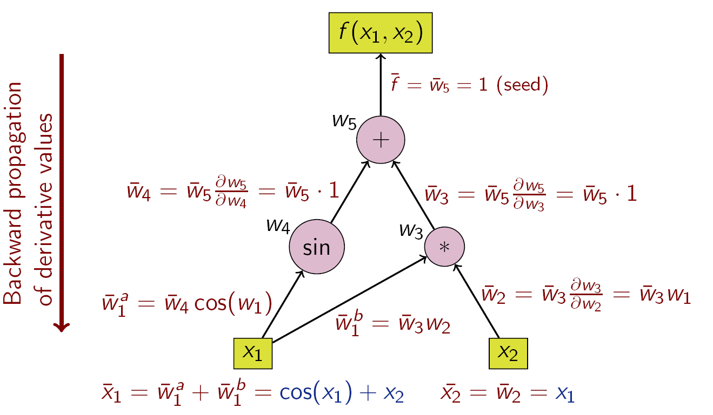

# Automatisches (Algorithmisches) Differenzieren

<!-- \newcommand\ipro[2]{\bigl \langle #1, \, #2\bigr\rangle } -->

In der Mathematik und im Bereich der Computeralgebra ist das *automatische
Differenzieren* (auch *Auto-Differenzieren*, *Autodiff* oder einfach *AD*
genannt und in anderen communities als *algorithmisches Differenzieren* oder
*computergestütztes Differenzieren* bezeichnet), ein Satz von Techniken zur
Berechnung (der Werte(!)) der partiellen Ableitung einer durch ein
Computerprogramm spezifizierten Funktion.

AD nutzt die Tatsache, dass jede Computerberechnung,
egal wie kompliziert, eine Sequenz von elementaren arithmetischen Operationen
(Addition, Subtraktion, Multiplikation, Division usw.) und elementaren
Funktionen (exp, log, sin, cos usw.) ausführt. Durch wiederholte Anwendung der
Kettenregel auf diese Operationen können partielle Ableitungen beliebiger
Ordnung automatisch, genau bis zur Arbeitspräzision und mit höchstens einem
kleinen konstanten Faktor mehr an arithmetischen Operationen als das
ursprüngliche Programm berechnet werden.

## Andere Differentiationsmethoden

In manchen Anwendungsf&auml;llen wird auf eine symbolische Repr&auml;sentation von
Funktionen und Variablen in der computergest&uuml;tzten Berechnung
zur&uuml;ckgegriffen. Sogenannte Computeralgebra Pakete wie `Maple`,
`Mathematica` oder die *Python* Bibliotheken `SageMath` oder `Sympy` k&ouml;nnen
dann automatisiert auch Operationen auf Funktionen wie Integralberechnung und
eben auch Differentiation *exakt* ausf&uuml;hren. Durch die Kettenregel und
unter der Massgabe, dass alle Codes letztlich nur elementare Funktionen mit
bekannten Ableitungen verschalten, w&auml;re es auch m&ouml;glich, bei
entsprechender Implementierung des prim&auml;ren Progamms, auch automatisiert
die Ableitungen zu erzeugen. Allerdings ist der Mehraufwand in der symbolischen
Programmierung erheblich und die Auswertung der Ausdr&uuml;cke langsam, sodass
symbolische Berechnungen (und entsprechend auch die M&ouml;glichkeit der
symbolischen automatischen Differentiation) nur in spezifischen und insbesondere
nicht in "grossen" und "multi-purpose" Algorithmen zur Anwendung kommen.


::: {#ad-vs-sd .JHSAYS data-latex=''}
Auch AD rechnet symbolisch und rekursiv mit der Kettenregel. Der Unterschied ist, dass AD nur mit Funktionswerten der
Ableitungen arbeitet w&auml;hrend die symbolische Ableitung versucht, die
Ableitung als Funktion zu erzeugen.
:::

Auf der anderen Seite steht die *numerische Differentiation* (beispielsweise durch Berechnung von Differenzenquotienten). 
Diese Methode ist universell (Ableitungen k&ouml;nnen ohne Kenntnis dessen
berechnet werden, was im Innern des Programms alles passiert) ist jedoch enorm schlecht konditioniert (da im
Z&auml;hler des Differenzenquotienten fast gleich grosse Gr&ouml;&szlig;en
subtrahiert werden). Die Bestimmung einer passenden Schrittweite muss immer *ad
hoc* erfolgen und macht diese Berechnung zus&auml;tzlich teuer.

Sind h&ouml;here Ableitungen gefragt, verst&auml;rken sich zudem die
Komplexit&auml;t (f&uuml;r die symbolische Berechnung) und die Fehlerverst&auml;rkung (in der numerischen Differentiation).

## Anwendungen

Automatisches Differenzieren ist ein entscheidender Baustein im Erfolg des
maschinellen Lernens. Jan k&ouml;nnte sagen, dass ohne AD die Optimierung der
neuronalen Netze mit tausenden bis Millionen von Parametern nicht m&ouml;glich
w&auml;re.

## Vorwärts- und Rückwärtsakkumulation

### Kettenregel der partiellen Ableitungen zusammengesetzter Funktionen

Grundlegend für die automatische Differentiation ist die Zerlegung von
Differentialen, die durch die Kettenregel der partiellen Ableitungen
zusammengesetzter Funktionen bereitgestellt wird. Für die einfache
Zusammensetzung

\begin{align*}
y &= f(g(h(x))) = f(g(h(w_0))) = f(g(w_1)) = f(w_2) = w_3 \\
w_0 &= x \\ 
w_1 &= h(w_0) \\
w_2 &= g(w_1) \\
w_3 &= f(w_2) = y
\end{align*}

ergibt die Kettenregel f&uuml;r die Werte zu einem fixen Wert $x^*$ von $x$:

\begin{equation}
\begin{split}
\frac{\partial y(x^*)}{\partial x} &= 
\frac{\partial y}{\partial w_2}\Biggl|_{w_2=g(h(x^*))} \frac{\partial w_2}{\partial w_1} \Biggl|_{w_1=h(x^*)}\frac{\partial w_1}{\partial w_0}\Biggl|_{w_0=x^*} \\
&= \frac{\partial f}{\partial w_2}(w_2^*)\biggl[ \frac{\partial g}{\partial w_1}(w_1^*) \Bigl[\frac{\partial h}{\partial x}(w_0^*) \Bigr] \biggr]
\end{split}
(\#eq:eqn-chainrule-fgh)
\end{equation}

F&uuml;r multivariate Funktionen gilt die mehrdimensionale Kettenregel und das
Produkt der Ableitungen wird zum Produkt der Jacobi-Matrizen.

## AD -- Vorw&auml;rtsmodus

Im sogenannten *Vorw&auml;rtsmodus* (auch *forward accumulation*) wird jede Teilfunktion im Programm
so erweitert, dass mit dem Funktionswert direkt der Wert der Ableitung
mitgeliefert wird. Ein Programmfluss f&uuml;r obiges $f$, $g$, $h$ Beispiel
w&uuml;rde also jeweils immer zwei Berechnungen machen und die Ableitung
*akkumulieren*:


| Schritt | Funktionswert | Ableitung | Akkumulation |
| --- | ------ | --- | ---- |
| `0` | $w_0 = x$ | $\dot w_0 = 1$ | $1$ |
| `1` | $(w_1, \dot w_1) = (h(w_0), h'(w_0))$ | $\dot w_1$ | $\dot w_1 \cdot 1$ |
| `2` | $(w_2, \dot w_2) = (g(w_1), g(w_1))$ | $\dot w_2$ | $\dot w_2 \cdot\dot w_1 \cdot 1$ |
| `3` | $(w_3, \dot w_3) = (f(w_1), f(w_1))$ | $\dot w_3$ | $\dot w_3 \cdot\dot w_2 \cdot\dot w_1 \cdot 1$ |

Das ergibt die Ableitung als den finalen Wert der Akkumulation. Wir bemerken,
dass hierbei

 * die Ableitung entlang des Programmflusses immer direkt mitbestimmt wird
   (deshalb *vorw&auml;rts* Modus)
 * es gen&uuml;gt im Schritt $k$, den Wert $w_{k-1}$ und die Akkumulation zu
   kennen.
 * F&uuml;r eine Funktion $F\otimes G \otimes h \colon \mathbb R^{}\to \mathbb R^{m}$, funktioniert die Berechnung ganz analog mit beispielsweise 
   \begin{equation*}
   (G, \partial G) \colon \mathbb R^{} \to \mathbb R^{\ell} \times  \mathbb R^{\ell}
   \end{equation*}
   und 
   \begin{equation*}
   (F, \partial F) \colon \mathbb R^{\ell} \to \mathbb R^{m} \times  \mathbb
   R^{m \times \ell}
   \end{equation*}
   und der Akkumulation
   \begin{equation*}
   \frac{\partial y}{\partial x}(x^*) = \partial F(w_2)\cdot \partial G(w_1)\cdot h'(w_0) \cdot 1.
   \end{equation*}
 * F&uuml;r eine Funktion in mehreren Variablen, d.h. von $\mathbb R^{n}$ nach $\mathbb R^{m}$, werden die
   partiellen Ableitungen $\frac{\partial y}{\partial x_k}$ separat in eigenen Durchl&auml;fen berechnet:
     * damit ist an der Implementierung nichts zu &auml;ndern, nur die
       Akkumulation wird mit $\dot w_0 = \begin{bmatrix} 0 & \dotsm & 1 & 0
       & \dotsm & 0 \end{bmatrix}^T$ initialisiert
     * eine simultane Berechnung aller Ableitungen verursacht vergleichsweise
       viel *overhead* (entweder m&uuml;ssen die verschiedenen Richtungen im
       Code
       organisiert werden oder es m&uuml;ssen alle Zwischenberechnungen der
       Ableitung gespeichert werden).


::: {#fwd-ad-vs-bwd .JHSAYS data-latex=''}

Wir halten fest, dass der *Vorw&auml;rtsmodus* gut funktioniert f&uuml;r skalare
Eing&auml;nge unabh&auml;ngig von der Zahl der Ausg&auml;nge. Wir werden lernen,
dass sich beim R&uuml;ckw&auml;rtmodus dieses Verh&auml;ltnis umdreht. Damit:

- *Vorwärtsakkumulation*: Bevorzugt für Funktionen \(f \colon \mathbb{R}^n \rightarrow \mathbb{R}^m\), wobei \(n \ll m\).
- *Rückwärtsakkumulation*: Bevorzugt für Funktionen \(f\colon \mathbb{R}^n \rightarrow \mathbb{R}^m\), wobei \(n \gg m\).

Vor allem f&uuml;r neuronale Netze mit vielen Parametern und dem Fehler als
(skalaren) Ausgang, ist der R&uuml;ckw&auml;rtsmodus fraglos die Methode der
Wahl. Hier wird dann typischerweise von *backpropagation* gesprochen, was eine
Adaption der Methode an die Architektur typischer neuronaler Netze ist.

:::

Bevor wir zum R&uuml;ckw&auml;rtsmodus kommen, noch einige Praktische
Bemerkungen anhand eines konkreten Beispiel.

Zun&auml;chst mal die Bemerkung, dass es vorteilhaft ist, ein Programm als ein Graph der
die Abh&auml;ngigkeiten der Variablen enth&auml;lt, darzustellen. Dann werden
insbesondere "nicht vorhandene" Abh&auml;ngigkeiten vermieden und Speicher-- und
Rechenaufwand reduziert. 

Entsprechend werden die Zwischenwerte $w_i$ nicht mehr einfach durchnummeriert,
sondern es wird von Vorg&auml;ngern gesprochen

> $w_j$ ist ein *Vorg&auml;nger* von $w_i$ genau dann wenn $w_i$ unmittelbar
> (also *explizit*) von $w_j$ abh&auml;ngt.

Damit (und mit Anwendung der Kettenregel im mehrdimensionalen) wird aus
$\dot w_i = \frac{\partial w_i}{\partial w_{"i-1"}}$ der Ausdruck

$$
\dot w_i = \sum_{j \in \{\text{Vorgänger von i}\}} \frac{\partial w_i}{\partial w_j} \dot w_j
$$

F&uuml;r das Beispiel 
\begin{align*}
y
&= f(x_1, x_2) \\
&= x_1 x_2 + \sin x_1 \\
&=: w_1 w_2 + \sin w_1 \\
&=: w_3 + w_4 \\
&=: w_5
\end{align*}
ergibt sich folgender Berechnungsgraph und Fluss in der
Vorw&auml;rtsakkumulation.

<!--  -->
```{r fig-10-ad-fwd, out.width='100%', fig.show='hold', fig.cap='Beispiel für Vorwärtsakkumulation mit Berechnungsgraph', eval=TRUE, echo=FALSE}
knitr::include_graphics('bilder/ForwardAccumulationAutomaticDifferentiation.png')
```

Mit den folgenden Schritten ergibt sich f&uuml;r die partielle
Ableitung von $y$ bez&uuml;glich $x_1$

| Schritt | Funktionswert | Ableitung | Akkumulation |
| --- | ----- | ------ | ------------ |
| `0a` | $w_1=x_1$ | | $\dot w_1 = 1$  |
| `0b` | $w_2=x_2$ |  | $\dot w_2 = 0$  |
| `1a` | $w_3 = w_1w_2$ | $\partial w_3 = \begin{bmatrix}
w_2&w_1\end{bmatrix}$ | $\dot w_3 = \begin{bmatrix}w_2&w_1\end{bmatrix}\begin{bmatrix}
1 \\ 0 \end{bmatrix} = x_2$ |
| `1b` | $w_4 = \sin(w_1)$ | $\partial w_4=\cos(w_1)$ | $\dot w_4 =\cos(w_1)\cdot\dot w_1 = \cos(x_1)$ |
| `2` | $w_5 = w_3 + w_4$ | $\partial w_5=\begin{bmatrix}1 & 1\end{bmatrix}$ | $\dot w_5 = \begin{bmatrix}1 & 1\end{bmatrix}\begin{bmatrix} \dot w_3 \\ \dot w_4 \end{bmatrix} = x_2 + \cos(x_1)$ |


## R&uuml;ckw&auml;rtsmodus

Bei der Rückwärtsakkumulation werden die sogenannten *Adjungierten* 
\begin{equation*}
\bar{w}_i = \frac{\partial y}{\partial w_i}
\end{equation*}
berechnet. Jan beachte, dass immer $y$ *differenziert* wird und dass der
gew&uuml;nschte Ausdruck bei beispielsweise $\bar x = \frac{\partial y}{\partial
x}$ erreicht ist.

Unter Verwendung der Kettenregel ergibt sich die folgende rekursive Formel aus dem
Berechnungsgraphen:

$$\bar{w}_i = \sum_{j \in \{\text{Nachfolger von i}\}} \bar{w}_j \frac{\partial w_j}{\partial w_i}$$
Sind also *sp&auml;tere* Adjungierte $\bar w_j$ bekannt, k&ouml;nnen
*fr&uuml;here* $\bar w_i$ bestimmt werden.

Die Rückwärtsakkumulation durchläuft die Kettenregel (wie in Gleichung
\@ref(eq:eqn-chainrule-fgh) von außen nach
innen oder im Falle des Berechnungsgraphen (wie in Abbildung \@ref(fig:fig-10-ad-bw) illustriert) von oben nach unten.


<!-- {#fig-10-ad-bw width="100%"} -->

```{r fig-10-ad-bw, out.width='100%', fig.show='hold', fig.cap='Beispiel für Rückwärtsakkumulation mit Berechnungsgraph', eval=TRUE, echo=FALSE}

```

Die Operationen zur Berechnung der Ableitung mittels Rückwärtsakkumulation sind in der folgenden Tabelle dargestellt (beachte die umgekehrte Reihenfolge):

| Schritt | Funktionswert | Ableitung | Adjungierte |
| --- | ----- | ------ | ------------ |
| `0` | $y=w_5$ | $\partial y=1$ | $\bar w_5 = 1$  |
| `1` | $w_5=w_4+w_3$ | $\partial w_5=\begin{bmatrix} 1&1 \end{bmatrix}$ | $\bar w_5 = 1$  |
| `2a` | $w_4=\sin(w_1)$ | $\partial w_4=\cos(w_1)$ | $\bar w_4 = \bar w_5 \cdot 1 = 1$  |
| `2b` | $w_3=w_1w_2$ | $\partial w_3=\begin{bmatrix}w_2&w_1\end{bmatrix}$ | $\bar w_3 = \bar w_5 \cdot 1 = 1$  |
| `3b` | $w_2=x_2$ | | $\bar w_2 = \bar w_3 w_1= x_1$  |
| `3a` | $w_1=x_1$ | | $\bar w_1 = \bar w_3 w_2 +\bar w_4 \cos(w_1) = x_2 + \cos(x_1)$  |

Wir bemerken, dass in einem Durchlauf, beide partiellen Ableitungen 
\begin{equation*}
\bar w_2 = \frac{\partial y}{\partial w_2}= \frac{\partial y}{\partial x_2},\quad \bar w_1 = \frac{\partial y}{\partial w_1}= \frac{\partial y}{\partial x_1}
\end{equation*}
direkt
berechnet werden. Allerdings m&uuml;ssen zun&auml;chst in einem
Vorw&auml;rsdurchlauf die Gradienten $\partial w_i$ berechnet und gespeichert werden.
Das kann bei komplexen Programmen durchaus ein Nachteil sein. Ein Ausweg bietet
*checkpointing* wo nur wenige Zwischenetappen der Werte $w_i$ gespeichert
werden, aus denen bei Bedarf die Nachfolger und Gradienten zwischen den
Checkpoints erzeugt werden k&ouml;nnen.

Zus&auml;tzlich muss der Programmablauf (also welche Variablen aus welchen
hervorgegangen sind -- die sogenannte *Wengert Liste*) verf&uuml;gbar sein.

H&auml;tte $y$ mehrere Komponenten, m&uuml;sste
f&uuml;r jede Komponente die entsprechenden adjungierten in einem neuen
Durchlauf berechnet werden.

Andersherum ist es beim Vorw&auml;rtsmodus, bei welchem mehrere Komponenten im
Ausgang direkt berechnet werden aber f&uuml;r jede Eingangsvariable die
Akkumulation separat durchgef&uuml;hrt werden muss.

# Implementierungen, Anwendungsbeispiele, Backpropagation

## Exkurs -- Gradienten und Repr&auml;sentation

Die Berechnung von Gradienten ist ebenso wesentlich wie schwierig in numerischen
Algorithmen. 
Viele *erfolgreiche* Algorithmen basieren auf effizient berechenbaren
Darstellungen oder Approximationen des Gradienten.

Ein erstes Beispiel ist der stochastische Gradientenabstieg, der auf einen
Sch&auml;tzer statt des eigentlichen Gradienten baut.

In der Optimierung mit (partiellen) Differentialgleichungen wie 
\begin{equation*}
\mathcal J(u) = \frac 12 \int_0^T\|x(t)-x^*\|^2 + \|u(t)\|^2\,\mathsf{d}s\to \min_{u} \quad \text{s.t. }\dot x(t) =
Ax(t) + Bu(t)
\end{equation*}
macht es einen entscheidenden Unterschied, dass der Gradient 
$$\partial_u \mathcal J(u) = u + B^Tp $$
&uuml;ber die L&ouml;sung der adjungierten Gleichung
\begin{equation*}
-\dot p(t) = A^T p(t) + x(t)-x^*, \quad p(T) = 0
\end{equation*}
definiert ist (siehe beispielsweise (Kurdila/Zarabankin, Thm 5.5.1) f&uuml;r ein
abstraktes Resultat und bspw. (Troeltzsch Abschnitt 5.9.1) f&uuml;r eine
Umsetzung in einem Gradientenabstiegsverfahren mit PDEs). 

W&auml;hrend diese Resultate in der Theorie die Wohlgestelltheit der
Optimierungsprobleme helfen zu analysieren, werden Sie in der Praxis gerne
verwendet weil die L&ouml;sung einer Differentialgleichung einfacher umzusetzen
ist (und im Zweifel auch effizienter) als die Berechnung von sehr abstrakten
Gradienten.

Um abstraktere Gradienten zu charakterisieren ist oftmals die Definition der
*totalen Ableitung* einer Funktion $f\colon X\to Y$ bei einem $x\in X$ als die lineare Abbildung $L(x)\colon X\to Y$ derart, dass
\begin{equation*}
f(x+h) - f(x) - L(x)[h] = o(\| h\|)
\end{equation*}
f&uuml;r $h\in X$ gilt.

Seien beispielsweise die R&auml;ume als $X=Y=\mathbb R^{n\times n}$ gegeben und 
\begin{equation*}
f(S) = A^TS + SA -SRS + Q
\end{equation*}
dann hat der *Riccati* Operator $f$ mit Koeffizienten $A$, $R$, $Q \in \mathbb R^{n\times n}$
demnach die Realisierung des Gradienten (an der Stelle $S_0$) gegeben als
\begin{equation*}
L(S_0)[h] = (A^T-S_0R)h + h(A-RS_0).
\end{equation*}

F&uuml;r neuronale Netze ist der Gradient von $f(x; \tilde A, b)=\tilde Ax+b$ bez&uuml;glich der
*Gewichte* $\tilde A\in \mathbb R^{m\times n-1}$ und $b\in \mathbb R^{m}$ interessant.
Zun&auml;chst mal verstehen wir die affine lineare Abbildung im
projektiven Raum verm&ouml;ge
\begin{equation*}
y = Ax + b \longleftrightarrow \begin{bmatrix} y \\ 1 \end{bmatrix} = \begin{bmatrix}A & b \\ 0 & 1 \end{bmatrix}\begin{bmatrix} x \\ 1
\end{bmatrix}
\end{equation*}
und betrachten einfach $f(x; A)=Ax$ mit $A\in \mathbb R^{m\times n}$. Gem&auml;&szlig; der Ableitungsformel gilt
\begin{equation*}
f(x;A+h) - f(x;A) - hx = (A+h)x - Ax - hx = 0 = o(\|h\|)
\end{equation*}
also im Prinzip ist $L(A)\leftrightarrow x$ die Ableitung wenn auch nicht als Vektor sondern als
\begin{equation*}
L_{[x]}\colon \mathbb R^{n\times m} \to \mathbb R^{n}\colon h\to L_{[x]} h = hx.
\end{equation*}

::: {#Lx-not-LA .JHSAYS data-latex=''}
Weil hier an der Stelle $A$ abgeleitet wird, sollte hier $L(A)$ stehen. Da bei
linearen Abbildung die Ableitung &uuml;berall gleich ist, gilt $L(A)\equiv L$
unabh&auml;ngig von $A$. F&uuml;r sp&auml;ter wird es interessant sein, dass
die Ableitung direkt mit $x$ zusammenh&auml;ngt, sodass wir das $x$ in die
Definition mit aufnehmen.
:::

Diese Abbildung $L_{[x]}$ ist linear und k&ouml;nnte als Matrix (bzw. Tensor im Sinne
einer h&ouml;herdimensionalen Datenstruktur)
im $\mathbb R^{n \times (n\times m)}$ realisiert werden.


## Backpropagation

Die besondere Architektur neuronaler Netze, wie sie im Machine Learning
verwendet werden, impliziert eine besondere Struktur in der
Gradientenberechnung.


Wir betrachten ein 2-layer Netzwerk
\begin{equation*}
s(x) = \sigma(A_2 \sigma(A_1x))
\end{equation*}
mit den *bias*-Vektoren $b_1$ und $b_2$ wie oben erl&auml;utert bereits in den Matrizen $A_1\in \mathbb R^{n_0\times n_1}$ und $A_2 \in \mathbb R^{n_2\times n_1}$ integriert.
F&uuml;r das *learning* wird zu Datenpunkten $(x, y) \in \mathbb R^{n_0}\times \mathbb R^{n_2}$ die Ableitung der Funktion
\begin{equation*}
(A_1, A_2) \to l(x; A_1, A_2) = \|y-s(x)\|_2^2
\end{equation*}
bez&uuml;glich des Parameter"vektors" $p=(A_2, A_1)$ gesucht.

Eine erste Anwendung der Kettenregel ergibt
\begin{equation*}
\frac{\partial}{\partial p}l(x; p) = -2\ipro{y-s(x;p)}{\partial_p s(x;p)}
\end{equation*}
sodass wir uns erstmal um die Ableitung von $s$ bez&uuml;glich $p$ k&uuml;mmern
k&ouml;nnen.


Bez&uuml;glich $A_2$ ergibt die Kettenregel direkt
\begin{equation*}
\frac{\partial s}{\partial A_2} = \sigma'(A_2x_1)L_{[x_1]}
\end{equation*}
wobei 

* $x_1:=\sigma(A_1x)$ der Zwischenwert nach der vorletzten (hier der ersten) *layer* ist,
* $\sigma'(A_2x_1)\in \mathbb R^{n_2'\times n_2}$ die (diagonale) Jacobimatrix der komponentenweise definierten Aktivierungsfunktion $\sigma$
* und $L_{[x_1]}\in \mathbb R^{n_2\times (n_2\times n_1)}$ die Ableitung von $A_2x_1$ nach $A_2$ (vgl. oben). 

Bez&uuml;glich $A_1$ ergibt die Kettenregel direkt
\begin{equation*}
\frac{\partial s}{\partial A_1} = \sigma'(A_2x_1)A_2\sigma'(A_1x)L_{[x]}
\end{equation*}

### Rekursion

Wir bemerken, dass die $A_i$ Komponenten des Gradienten von $s$ &uuml;ber
\begin{equation*}
\delta_N := \sigma'(A_Nx_{N-1}), \quad \partial_{A_N} s(x) = \delta_N L_{[x_{N-1}]}
\end{equation*}
f&uuml;r die letzte *layer* und dann rekursiv &uuml;ber

\begin{equation*}
\delta_{n-1} := \delta_n\sigma'(A_{n-1}x_{n-1}), \quad \partial_{A_{n-1}} s(x) = \delta_{n-1} L_{[x_{n-2}]}
\end{equation*}
von der letzten bis zur ersten *layer* berechnet werden k&ouml;nnen.

## Praktische Berechnung des Gradienten

::: {#grad-vs-jac .JHSAYS data-latex=''}
Im sch&ouml;nsten *machine learning*-Sprech sagt Jan hier immer Gradient obwohl
eher die Ableitung oder die Jacobi Matrix gemeint ist.
:::

Mit $\hat y = -2(y-s(x;p)) \in \mathbb R^{n_2\times 1}$ bekommen wir aus obigen Formeln, dass
\begin{equation*}
\begin{split}
\partial_{A_2}l(x; p) = \ipro{\hat y}{\partial_{A_2}s(x;p)} &= \hat y^T
\sigma'(A_2x_1)L_{[x_1]} \\
&= \tilde y^TL_{[x_1]}.
\end{split}
\end{equation*}

Eine Betrachtung der Dimensionen $\hat y \in \mathbb R^{n_2 \times 1}$,
$\sigma'(A_2x_1)\in \mathbb R^{n_2\times n_2}$ und $L_{[x_1]}\in \mathbb
R^{n_2\times(n_2\times n_1)}$ ergibt f&uuml;r das Produkt, dass 
\begin{equation*}
\tilde y^T L_{[x_1]} \in \mathbb R^{1\times (n_2 \times n_1)}
\end{equation*}
sodass wir schon fast den Gradienten zum Parameter $A_2 \in \mathbb R^{n_2
\times n_1}$ addieren k&ouml;nnen. 

Wir berechnen die Eintr&auml;ge $g_{1ij}$ des Gradienten $\tilde y^T L_{[x_1]}$
als die $1$-te (und einzige -- da der Bildraum 1-dimensional ist) Komponente
(bzgl. die kanonischen Basis) auf die der $ij$ kanonische Basisvektor aus dem
Urbildraum abgebildet wird. Hier bietet sich als kanonische Basis $\{e^{(ij)}\}$
die Menge der Matrizen an, die $0$ sind bis auf eine $1$ in der $i$-ten Zeile an der
$j$-ten Stelle. In der Tat gilt dann
\begin{equation*}
\mathbb R^{n_2\times n_1}\ni A = [a_{ij}] \leftrightarrow A =
\sum_{i,j}a_{ij}e^{(ij)}
\end{equation*}
Damit gilt
\begin{equation*}
g_{1ij}=\tilde y^TL_{[x_1]}e^{(ij)} = \tilde y^T e_{ij}x_1 = \tilde y_i (x_{1})_j
\end{equation*}
sodass wir als $1$-te und einzige (matrixwertige) Komponente des Gradienten das
&auml;u&szlig;ere Produkt von $\tilde y$ und $x_1$ erhalten
\begin{equation*}
(\tilde y^T L_{[x_1]})_1 = \tilde y x_1^T \in \mathbb R^{n_2 \times n_1}.
\end{equation*}

## Implementierungsbeispiele

* Beispiel in PyTorch
* CASADI
* Nico Gauger

## Aufgaben

### Ableitung und Newton

Weisen Sie nach, dass der Gradient der (matrixwertigen) Riccati Abbildung
tats&auml;chlich die gegebene Form hat und formulieren Sie damit ein Newton
Verfahren zur L&ouml;sung der Riccati Gleichung $f(S)=0$.
