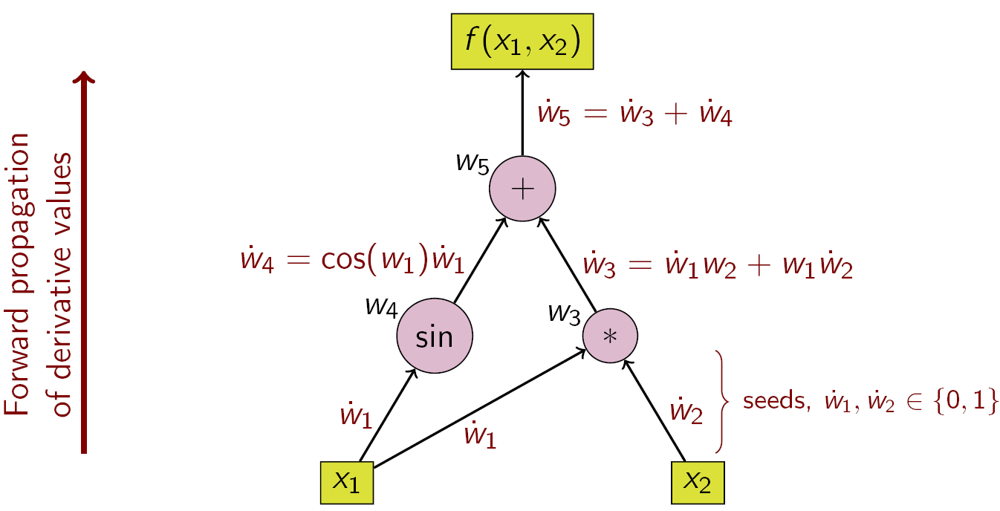
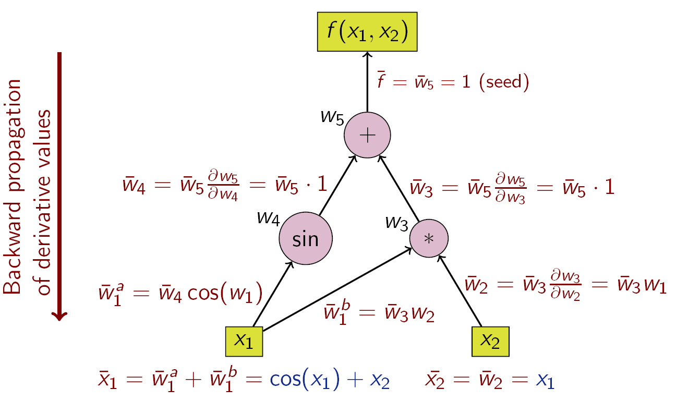

# Automatisches (Algorithmisches) Differenzieren

In der Mathematik und im Bereich der Computeralgebra ist das *automatische
Differenzieren* (auch *Auto-Differenzieren*, *Autodiff* oder einfach *AD*
genannt und in anderen communities als *algorithmisches Differenzieren* oder
*computergestütztes Differenzieren* bezeichnet), ein Satz von Techniken zur
Berechnung (der Werte(!)) der partiellen Ableitung einer durch ein
Computerprogramm spezifizierten Funktion.

AD nutzt die Tatsache, dass jede Computerberechnung,
egal wie kompliziert, eine Sequenz von elementaren arithmetischen Operationen
(Addition, Subtraktion, Multiplikation, Division usw.) und elementaren
Funktionen (exp, log, sin, cos usw.) ausführt. Durch wiederholte Anwendung der
Kettenregel auf diese Operationen können partielle Ableitungen beliebiger
Ordnung automatisch, genau bis zur Arbeitspräzision und mit höchstens einem
kleinen konstanten Faktor mehr an arithmetischen Operationen als das
ursprüngliche Programm berechnet werden.

## Andere Differentiationsmethoden

In manchen Anwendungsf&auml;llen wird auf eine symbolische Repr&auml;sentation von
Funktionen und Variablen in der computergest&uuml;tzten Berechnung
zur&uuml;ckgegriffen. Sogenannte Computeralgebra Pakete wie `Maple`,
`Mathematica` oder die *Python* Bibliotheken `SageMath` oder `Sympy` k&ouml;nnen
dann automatisiert auch Operationen auf Funktionen wie Integralberechnung und
eben auch Differentiation *exakt* ausf&uuml;hren. Durch die Kettenregel und
unter der Massgabe, dass alle Codes letztlich nur elementare Funktionen mit
bekannten Ableitungen verschalten, w&auml;re es auch m&ouml;glich, bei
entsprechender Implementierung des prim&auml;ren Progamms, auch automatisiert
die Ableitungen zu erzeugen. Allerdings ist der Mehraufwand in der symbolischen
Programmierung erheblich und die Auswertung der Ausdr&uuml;cke langsam, sodass
symbolische Berechnungen (und entsprechend auch die M&ouml;glichkeit der
symbolischen automatischen Differentiation) nur in spezifischen und insbesondere
nicht in "grossen" und "multi-purpose" Algorithmen zur Anwendung kommen.

::: {#ad-vs-sd .JHSAYS data-latex=''}
Auch AD rechnet symbolisch und rekursiv mit der Kettenregel. Der Unterschied ist, dass AD nur mit Funktionswerten der
Ableitungen arbeitet w&auml;hrend die symbolische Ableitung versucht, die
Ableitung als Funktion zu erzeugen.
:::

Auf der anderen Seite steht die *numerische Differentiation* (beispielsweise durch Berechnung von Differenzenquotienten). 
Diese Methode ist universell (Ableitungen k&ouml;nnen ohne Kenntnis dessen
berechnet werden, was im Innern des Programms alles passiert) ist jedoch enorm schlecht konditioniert (da im
Z&auml;hler des Differenzenquotienten fast gleich grosse Gr&ouml;&szlig;en
subtrahiert werden). Die Bestimmung einer passenden Schrittweite muss immer *ad
hoc* erfolgen und macht diese Berechnung zus&auml;tzlich teuer.

Sind h&ouml;here Ableitungen gefragt, verst&auml;rken sich zudem die
Komplexit&auml;t (f&uuml;r die symbolische Berechnung) und die Fehlerverst&auml;rkung (in der numerischen Differentiation).

## Anwendungen

Automatisches Differenzieren ist ein entscheidender Baustein im Erfolg des
maschinellen Lernens. Jan k&ouml;nnte sagen, dass ohne AD die Optimierung der
neuronalen Netze mit tausenden bis Millionen von Parametern nicht m&ouml;glich
w&auml;re.

## Vorwärts- und Rückwärtsakkumulation

### Kettenregel der partiellen Ableitungen zusammengesetzter Funktionen

Grundlegend für die automatische Differentiation ist die Zerlegung von
Differentialen, die durch die Kettenregel der partiellen Ableitungen
zusammengesetzter Funktionen bereitgestellt wird. Für die einfache
Zusammensetzung

\begin{align*}
y &= f(g(h(x))) = f(g(h(w_0))) = f(g(w_1)) = f(w_2) = w_3 \\
w_0 &= x \\ 
w_1 &= h(w_0) \\
w_2 &= g(w_1) \\
w_3 &= f(w_2) = y
\end{align*}

ergibt die Kettenregel f&uuml;r die Werte zu einem fixen Wert $x^*$ von $x$:

\begin{align*}
\frac{\partial y(x^*)}{\partial x} &= 
\frac{\partial y}{\partial w_2}\Biggl|_{w_2=g(h(x^*))} \frac{\partial w_2}{\partial w_1} \Biggl|_{w_1=h(x^*)}\frac{\partial w_1}{\partial w_0}\Biggl|_{w_0=x^*} \\
&= \frac{\partial f}{\partial w_2}(w_2^*)\biggl[ \frac{\partial g}{\partial w_1}(w_1^*) \Bigl[\frac{\partial h}{\partial x}(w_0^*) \Bigr] \biggr]
\end{align*}

F&uuml;r multivariate Funktionen gilt die mehrdimensionale Kettenregel und das
Produkt der Ableitungen wird zum Produkt der Jacobi-Matrizen.

## AD -- Vorw&auml;rtsmodus

Im sogenannten *Vorw&auml;rtsmodus* (auch *forward accumulation*) wird jede Teilfunktion im Programm
so erweitert, dass mit dem Funktionswert direkt der Wert der Ableitung
mitgeliefert wird. Ein Programmfluss f&uuml;r obiges $f$, $g$, $h$ Beispiel
w&uuml;rde also jeweils immer zwei Berechnungen machen und die Ableitung
*akkumulieren*:

| Schritt | Funktionswert | Ableitung | Akkumulation |
| --- | ------ | --- | ---- |
| `0` | $w_0 = x$ | $\dot w_0 = 1$ | $1$ |
| `1` | $(w_1, \dot w_1) = (h(w_0), h'(w_0))$ | $\dot w_1$ | $\dot w_1 \cdot 1$ |
| `2` | $(w_2, \dot w_2) = (g(w_1), g(w_1))$ | $\dot w_2$ | $\dot w_2 \cdot\dot w_1 \cdot 1$ |
| `3` | $(w_3, \dot w_3) = (f(w_1), f(w_1))$ | $\dot w_3$ | $\dot w_3 \cdot\dot w_2 \cdot\dot w_1 \cdot 1$ |

Das ergibt die Ableitung als den finalen Wert der Akkumulation. Wir bemerken,
dass hierbei

 * die Ableitung entlang des Programmflusses immer direkt mitbestimmt wird
   (deshalb *vorw&auml;rts* Modus)
 * es gen&uuml;gt im Schritt $k$, den Wert $w_{k-1}$ und die Akkumulation zu
   kennen.
 * F&uuml;r eine Funktion $F\otimes G \otimes h \colon \mathbb R^{}\to \mathbb R^{m}$, funktioniert die Berechnung ganz analog mit beispielsweise 
   \begin{equation*}
   (G, \partial G) \colon \mathbb R^{} \to \mathbb R^{\ell} \times  \mathbb R^{\ell}
   \end{equation*}
   und 
   \begin{equation*}
   (F, \partial F) \colon \mathbb R^{\ell} \to \mathbb R^{\ell} \times  \mathbb
   R^{m \times m}
   \end{equation*}
   und der Akkumulation
   \begin{equation*}
   \frac{\partial y}{\partial x}(x^*) = \partial F(w_2)\cdot \partial G(w_1)\cdot h'(w_0) \cdot 1.
   \end{equation*}
 * F&uuml;r eine Funktion in mehreren Variablen, d.h. von $\mathbb R^{n}$ nach $\mathbb R^{m}$, werden die
   partiellen Ableitungen $\frac{\partial y}{\partial x_k}$ separat in eigenen Durchl&auml;fen berechnet:
     * damit ist an der Implementierung nichts zu &auml;ndern, nur die
       Akkumulation wird mit $\dot w_0 = \begin{bmatrix} 0 & \hdots & 1 & 0
       & \hdots 0 \end{bmatrix}^T$ initialisiert
     * eine simultane Berechnung aller Ableitungen verursacht vergleichsweise
       viel *overhead* (entweder m&uuml;ssen die verschiedenen Richtungen im
       Code
       organisiert werden oder es m&uuml;ssen alle Zwischenberechnungen der
       Ableitung gespeichert werden).

::: {#fwd-ad-vs-bwd .JHSAYS data-latex=''}

Wir halten fest, dass der *Vorw&auml;rtsmodus* gut funktioniert f&uuml;r skalare
Eing&auml;nge unabh&auml;ngig von der Zahl der Ausg&auml;nge. Wir werden lernen,
dass sich beim R&uuml;ckw&auml;rtmodus dieses Verh&auml;ltnis umdreht. Damit:

- *Vorwärtsakkumulation*: Bevorzugt für Funktionen \(f \colon \mathbb{R}^n \rightarrow \mathbb{R}^m\), wobei \(n \ll m\).
- *Rückwärtsakkumulation*: Bevorzugt für Funktionen \(f\colon \mathbb{R}^n \rightarrow \mathbb{R}^m\), wobei \(n \gg m\).

Vor allem f&uuml;r neuronale Netze mit vielen Parametern und dem Fehler als
(skalaren) Ausgang, ist der R&uuml;ckw&auml;rtsmodus fraglos die Methode der
Wahl. Hier wird dann typischerweise von *backpropagation* gesprochen, was eine
Adaption der Methode an die Architektur typischer neuronaler Netze ist.

:::

Bevor wir zum R&uuml;ckw&auml;rtsmodus kommen, noch einige Praktische
Bemerkungen anhand eines konkreten Beispiel.

Zun&auml;chst mal die Bemerkung, dass es vorteilhaft ist, ein Programm als ein Graph der
die Abh&auml;ngigkeiten der Variablen enth&auml;lt, darzustellen. Dann werden
insbesondere "nicht vorhandene" Abh&auml;ngigkeiten vermieden und Speicher-- und
Rechenaufwand reduziert. 

Entsprechend werden die Zwischenwerte $w_i$ nicht mehr einfach durchnummeriert,
sondern es wird von Vorg&auml;ngern gesprochen

> $w_j$ ist ein *Vorg&auml;nger* von $w_i$ genau dann wenn $w_i$ unmittelbar
> (also *explizit*) von $w_j$ abh&auml;ngt.

Damit (und mit Anwendung der Kettenregel im mehrdimensionalen) wird aus
$\dot w_i = \frac{\partial w_i}{\partial w_{"i-1"}}$ der Ausdruck

$$
\dot w_i = \sum_{j \in \{\text{Vorgänger von i}\}} \frac{\partial w_i}{\partial w_j} \dot w_j
$$

F&uuml;r das Beispiel 
\begin{align*}
y
&= f(x_1, x_2) \\
&= x_1 x_2 + \sin x_1 \\
&=: w_1 w_2 + \sin w_1 \\
&=: w_3 + w_4 \\
&=: w_5
\end{align*}
ergibt sich folgender Berechnungsgraph und Fluss in der
Vorw&auml;rtsakkumulation.

## R&uuml;ckw&auml;rtsmodus

Bei der Rückwärtsakkumulation ist die Größe von Interesse der *Adjungierte*, bezeichnet mit einem Balken $\bar{w}_i$; es handelt sich um eine Ableitung einer gewählten abhängigen Variablen in Bezug auf einen Teilausdruck $w_i$:

$$\bar{w}_i = \frac{\partial y}{\partial w_i}$$

Unter Verwendung der Kettenregel, wenn $w_i$ Nachfolger im Berechnungsgraphen hat:

$$\bar{w}_i = \sum_{j \in \{\text{Nachfolger von i}\}} \bar{w}_j \frac{\partial w_j}{\partial w_i}$$

Die Rückwärtsakkumulation durchläuft die Kettenregel von außen nach innen oder im Falle des Berechnungsgraphen in Abbildung 3 von oben nach unten. Die Beispiel-Funktion ist skalarwertig, und daher gibt es nur einen Startwert für die Ableitungsberechnung, und nur einen Durchlauf des Berechnungsgraphen ist nötig, um den (zweikomponentigen) Gradienten zu berechnen. Dies ist nur halb so viel Arbeit im Vergleich zur Vorwärtsakkumulation, aber die Rückwärtsakkumulation erfordert das Speichern der Zwischenvariablen $w_i$ sowie der Anweisungen, die sie erzeugt haben, in einer Datenstruktur, die als "Band" oder Wengert-Liste bekannt ist (jedoch veröffentlichte Wengert die Vorwärtsakkumulation, nicht die Rückwärtsakkumulation), was erheblichen Speicher verbrauchen kann, wenn der Berechnungsgraph groß ist. Dies kann bis zu einem gewissen Grad gemildert werden, indem nur eine Teilmenge der Zwischenvariablen gespeichert und dann die notwendigen Arbeitsvariablen durch Wiederholung der Bewertungen rekonstruiert werden, eine Technik, die als Rematerialisierung bekannt ist. Auch das Checkpointing wird verwendet, um Zwischenstände zu speichern.

Die Operationen zur Berechnung der Ableitung mittels Rückwärtsakkumulation sind in der folgenden Tabelle dargestellt (beachte die umgekehrte Reihenfolge):

- $\bar{w}_5 = 1$ (Startwert)
- $\bar{w}_4 = \bar{w}_5 \cdot 1$
- $\bar{w}_3 = \bar{w}_5 \cdot 1$
- $\bar{w}_2 = \bar{w}_3 \cdot w_1$
- $\bar{w}_1 = \bar{w}_3 \cdot w_2 + \bar{w}_4 \cdot \cos(w_1)$

Der Datenflussgraph einer Berechnung kann manipuliert werden, um den Gradienten seiner ursprünglichen Berechnung zu berechnen. Dies geschieht durch Hinzufügen eines adjungierten Knotens für jeden primalen Knoten, verbunden durch adjungierte Kanten, die den primalen Kanten parallel verlaufen, aber in entgegengesetzter Richtung fließen. Die Knoten im adjungierten Graphen repräsentieren die Multiplikation mit den Ableitungen der Funktionen, die von den Knoten im primalen berechnet wurden. Zum Beispiel führt Addition im Primalen zu Fanout im Adjungierten; Fanout im Primalen führt zu Addition im Adjungierten; eine unäre Funktion $y = f(x)$ im Primalen führt zu $x̄ = ȳ f′(x)$ im Adjungierten; usw.

# Implementierungen, Anwendungsbeispiele, Backpropagation

...
